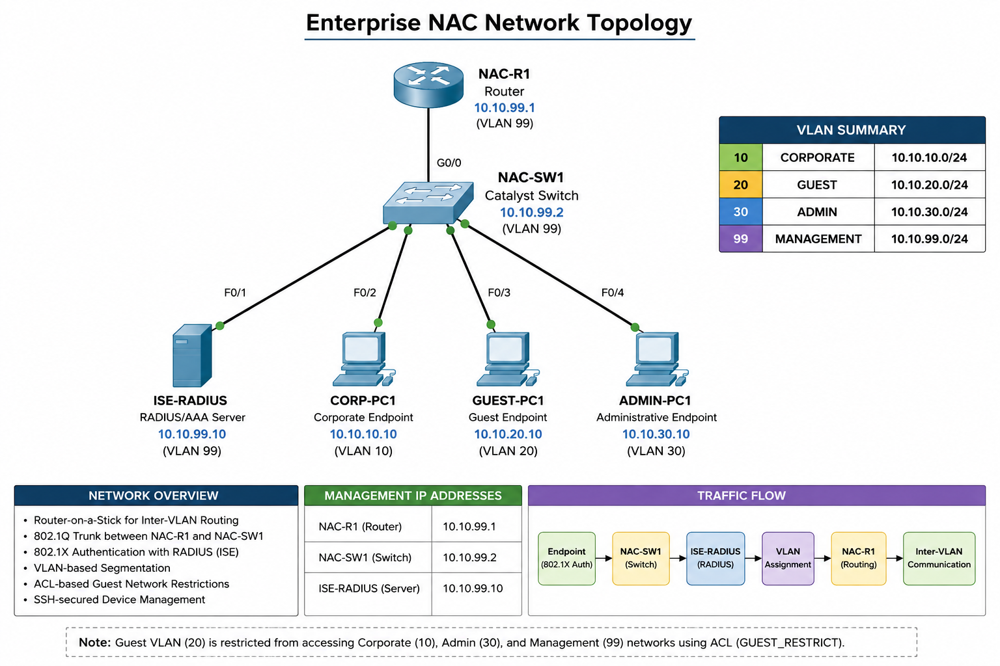

# Network Topology

## Overview

This lab demonstrates an enterprise Cisco Network Access Control (NAC) environment using Cisco ISE/RADIUS concepts with a Cisco switch and router.

The topology demonstrates 802.1X authentication, RADIUS integration, VLAN segmentation, Router-on-a-Stick inter-VLAN routing, SSH-based device management, and Guest network security.

## Network Devices

- NAC-R1 — Cisco Router
- NAC-SW1 — Cisco Catalyst Switch
- ISE-RADIUS — RADIUS/AAA Server
- CORP-PC1 — Corporate Endpoint
- GUEST-PC1 — Guest Endpoint
- ADMIN-PC1 — Administrative Endpoint

## VLAN Design

| VLAN | Name | Network | Gateway |
|------|------|---------|---------|
| 10 | CORPORATE | 10.10.10.0/24 | 10.10.10.1 |
| 20 | GUEST | 10.10.20.0/24 | 10.10.20.1 |
| 30 | ADMIN | 10.10.30.0/24 | 10.10.30.1 |
| 99 | MANAGEMENT | 10.10.99.0/24 | 10.10.99.1 |

## Management

| Device | IP Address |
|--------|------------|
| NAC-SW1 | 10.10.99.2 |
| ISE-RADIUS | 10.10.99.10 |
| NAC-R1 | 10.10.99.1 |

## Security Architecture

The lab implements:

- 802.1X authentication
- RADIUS authentication
- AAA
- Network Access Control concepts
- VLAN segmentation
- SSH-based device management
- VTY access control
- Guest network restrictions
- ACL-based security

## Topology Diagram



The diagram illustrates the enterprise NAC architecture, including:

- NAC-R1 router
- NAC-SW1 Cisco Catalyst switch
- ISE-RADIUS server
- Corporate endpoint
- Guest endpoint
- Administrative endpoint
- VLAN segmentation
- 802.1X authentication
- RADIUS authentication
- Router-on-a-Stick inter-VLAN routing
- Guest network ACL restrictions

## Traffic Flow

The corporate endpoint authentication flow is:

```text
CORP-PC1
   |
   | 802.1X / EAP
   v
NAC-SW1
   |
   | RADIUS Authentication Request
   v
ISE-RADIUS
   |
   | Authentication Response
   v
NAC-SW1
   |
   | Authenticated Access
   v
Corporate VLAN 10
```
## Inter-VLAN Routing Flow

Inter-VLAN communication is provided by NAC-R1 using Router-on-a-Stick:

```text
CORP VLAN 10
       |
GUEST VLAN 20 ---- NAC-SW1 ---- 802.1Q Trunk ---- NAC-R1
       |                                           |
ADMIN VLAN 30                                      |
       |                                           |
MANAGEMENT VLAN 99 -------------------------------+
```

The router provides the default gateway for each VLAN through 802.1Q subinterfaces.

## Guest Network Security

Guest VLAN 20 is restricted using the `GUEST_RESTRICT` extended ACL.

The ACL prevents Guest traffic from accessing:

- Corporate VLAN 10
- Administrative VLAN 30
- Management VLAN 99

Other permitted destinations remain accessible according to the configured ACL policy.

## Management Access

NAC-SW1 supports secure remote administration using SSH version 2.

Administrative access is controlled through:

- AAA authentication
- RADIUS authentication
- Local authentication fallback
- VTY access control
- SSH-only remote access

## Implementation Scope

This Packet Tracer topology demonstrates the core NAC architecture and authentication concepts.

Advanced Cisco ISE capabilities such as:

- MAB
- Endpoint Profiling
- Dynamic VLAN Assignment
- Guest Portal
- BYOD
- Posture Assessment
- Cisco TrustSec
- Security Group Tags (SGTs)
- pxGrid

are not implemented in the current topology and are considered future enhancements.

## Summary

The topology provides a practical enterprise-style NAC environment combining:

- 802.1X
- RADIUS
- AAA
- VLAN segmentation
- Router-on-a-Stick
- SSH
- ACL security
- Network verification
- Troubleshooting

The implementation is designed for educational and portfolio purposes using Cisco Packet Tracer.
